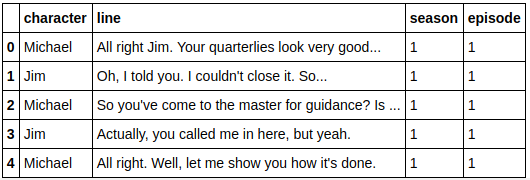
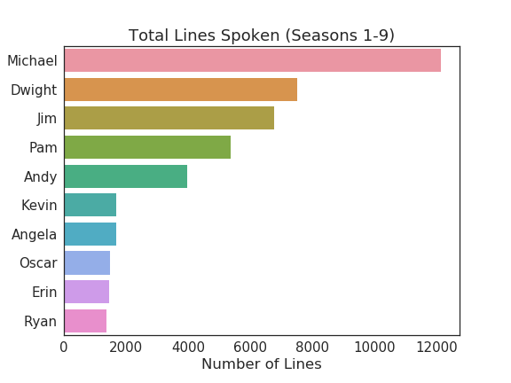
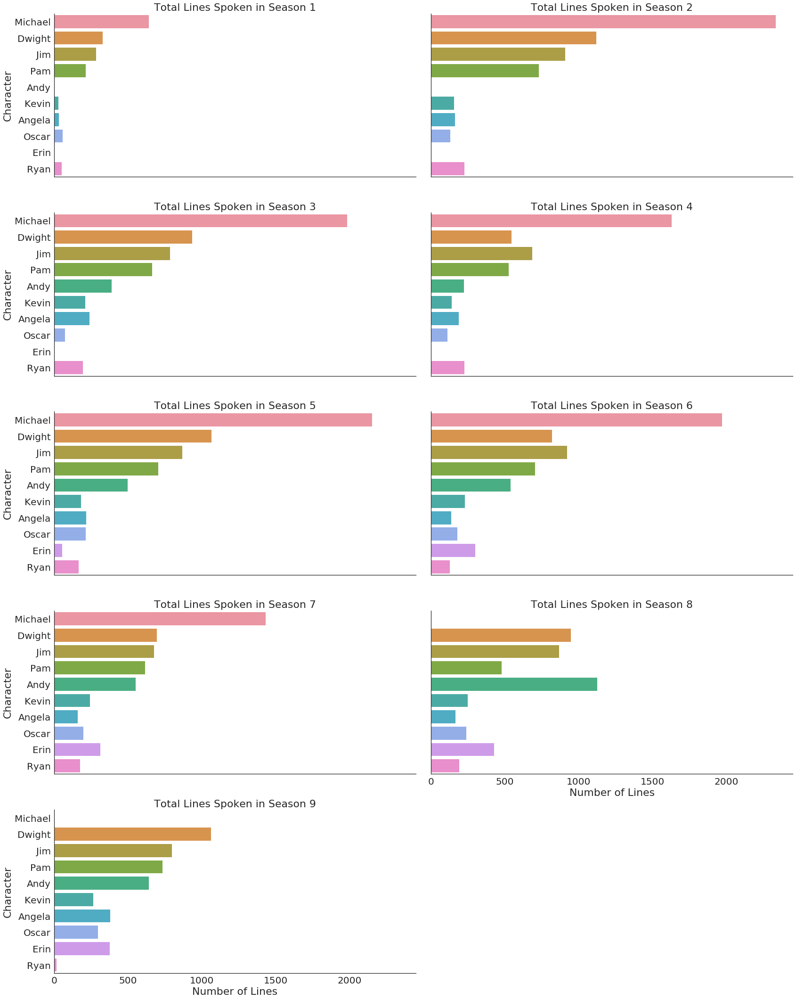
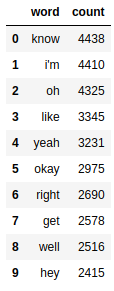
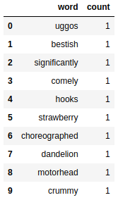
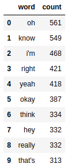
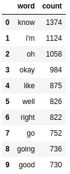
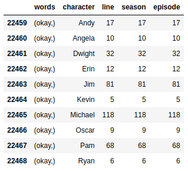

This is the second entry in a sequence of posts about working with natural language, and specifically the script of The Office. In the previous post, I showed how to use a combination of BeautifulSoup and Scrapy to get the script. In this post, I'll make a few points about cleaning the data and perform some exploratory data analysis (EDA).

All the relevant project code can be found in the GitHub repository [here](https://github.com/conleyst/bears-beets-nlp).

---

### Cleaning the Data

I won't walk through the entire script I used to clean the data, but I will make a few points. The code I used to clean it is [here](https://github.com/conleyst/bears-beets-nlp/blob/master/src/clean_lines.py).

1. One of the main challenges was getting the regular expressions right, particularly when I wanted to extract the name of the character delivering a line. I really recommend using a resource like [this site](https://regexr.com/), where you can experiment with the regex in an interactive setting to figure out what you need.

2. My suggestion in the last blog post to focus web-scraping efforts on just getting the data from the website to your local machine seems prescient. Although I don't claim that what I wrote to clean the JSON is the most efficient, getting there took enough time and experimentation that I'm glad I wasn't repeatedly scraping the website everytime I wanted to test the script.

3. When working with lists of lists (or lists of any iterable), `itertools` is very helpful.

After cleaning the data, we're left with a dataframe with four columns, specifying the character, the line, the season, and the episode. We can now use for EDA.

### EDA

I like exploring a dataset in a Jupyter notebook, since you can see everything inline and immediately. The one I created to explore this dataset is [here](https://github.com/conleyst/bears-beets-nlp/blob/master/results/EDA.ipynb), but I'll run through it here as well for completeness.

There are a few things we should be trying to take from any EDA, particularly with an ultimate goal of building a classifier in mind. For one, we should be the lookout that there's nothing weird in the data that might signify that we made a mistake in cleaning or processing it. Secondly, we should be trying to understand the size of the classes (i.e. how many lines were said by each character) and the type of language used. In an ideal setting, the language used by characters is very different, since this would help us correctly classify lines.

Let's take a quick peek at the dataframe to understand the format we have the data in,

We have characters in one column, a corresponding line in the second, and the season and episode the line is from in the third and fourth. In total, there are 59281 lines spoken in the show, but we can break this down by character and season. We'll just focus on the top ten speakers.

Michael has the most lines by far, and we see a gradual decrease roughly in proportion to what we might expect if we've seen the show. Breaking this down further by season, we see the same general pattern

The notable exception is in seasons eight and nine, which Michael is gone for and in which we see Andy take on more lines.

**Considering Character Vocabulary**

Focusing now on the different characters' vocabularies, with stopwords removed, there are 20962 unique words spoken over the course of The Office, and there are 321040 words spoken total. The most common words overall are,

These are of course extremely common words in real-life as well. The least common words are,

But in fact there are 9465 unique words that were only spoken once on the show.

If we start getting more character specific, the most common words don't really look that different. For example, the ten most common words for Jim are,

and the ten most common words for Michael are,

We see a lot of overlap. This doesn't seem promising for model performance. If characters tend to use the same words, then it suggests that the sentences they say might be similar as well. The more similar different characters' sentences are, the more difficult it will be for any classifier to tell them apart. This doesn't mean that a classifier we build can't be successful, but it does suggest that we should temper our expectations.

**The Issue of Shared Lines**

A final issue that we might not have thought of is that many lines are said by multiple characters. For example, consider a line 'Okay'. Ignoring punctuation, this line is said by every character,

Michael says it most (roughly one third of the time), but if we ask our classifier to predict on the line 'Okay', what's the correct answer? Any answer is debatably correct (and incorrect). There are a few approaches we can take in addressing this problem.

1. For one, we could do nothing. We accept that any model we train is going to be wrong fairly often.

2. Secondly, we could train a model that can give multiple labels to an observation. Thing of an image classifier given an image of a person sitting in a car. We might want the classifier to label it with 'Human' and 'Car'. Similarly, we could try and have our model label every line with all the people that might have said it. I opted not do go this route. It's an interesting problem, but a needless complication when my goal is to explore different approaches to tackling natural language problems.

3. Thirdly, we can throw out lines except for those said by the person who said them most. So in the above example, I would get rid of all "Okay" lines said by anyone other than Michael. Then every line has a uniquely correct label. *This is the strategy that I opted to use*. With how similar the word usage seem to be between characters, even with this change the problem is challenging.

In the next post, we'll train a baseline model and then see if we can beat it!
