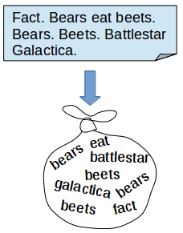
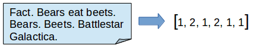
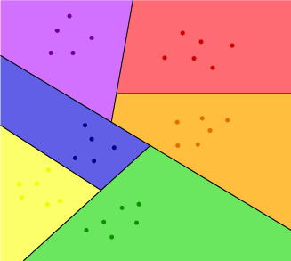

This is the third entry in a sequence of posts about working with natural language, and specifically the script of The Office. In the previous post, I cleaned the raw data that I scraped in Part 1 and then explored the cleaned data.

As a reminder, all the relevant project code can be found in the GitHub repository [here](https://github.com/conleyst/bears-beets-nlp).

---

### Training a Baseline Model: Bag-Of-Words and a Random Forest

Here we'll train a baseline model on the data that we cleaned in Part 2. A baseline model gives us exactly what's in the name -- a baseline. It's a model that we put together without a lot of feature engineering and that can generally be created and trained quickly. A baseline model is a great idea, since it gives a benchmark against which to mark your progress. If you use a fancy technique or model that doesn't beat the baseline model by much, then it might be a hint that you're not on the right track.

For a baseline model, I trained a random forest model and used a bag-of-words model for the text.

#### The Theory

**Bag-Of-Words**

The bag-of-words model is a way of representing a collection of text documents (often called a *corpus*) as vectors. It's called a bag-of-words because we treat each document (which for us is a line) as a (multi)set of words, without regard to the order of the words in the document or how the document compares to others in the corpus. The only thing considered is the count of the words in the document.

<p align="center">
  
</p>

We create a bag-of-words model by starting with the training data. We then go through every document and note which words appear in it. The collection of all words that appeared in the training documents form the *vocabulary* for the bag-of-words model. Every document is then converted to a vector using the vocabulary. In position one of the vector, we put the number of occurrences of the first word in the vocabulary, in the second position we put the number of occurrences of the second word in the vocabulary, etc.

For the line in the image above, "Fact. Bears eat beets. Bears. Beets. Battlestar Galactica.", if this were the only document, then our vocabulary would be (fact, bears, eat, beets, battlestar, galactica). The vector for the line would be as follows,

<p align="center">
  
</p>

For larger vocabularies, the bag-of-words representation of a document is generally very sparse.

Notice that we converted the words to lower case and dropped punctuation. This isn't strictly necessary, but it seems reasonable that all occurrences of the word "beet" in the line would get treated the same, regardless of capitalization. Optionally, we also remove *stop words*, for example "the", "and", or "a". The idea is that they are so frequent as to be uninformative, so to save memory and time, we might as well get rid of them.

One hiccup when it comes to using a bag-of-words representation is that the vocabulary of our training set might be different than the vocabulary of the test set. We don't add any new words to the vocabulary at test time, instead, any words in the test set that aren't in the training set are ignored.

**Random Forest**

Random forests are one of the most popular off-the-shelf models in machine learning. They generally perform well, are reasonably quick to train, and are very fast to predict with. A random forest is an *ensemble model*, meaning that it's actually a collection of several models, all working together. In the case of a random forest, the models in the ensemble are all *decision trees*.

> One of the best visualizations of a decision tree I've come across can be found in the article [here](http://www.r2d3.us/visual-intro-to-machine-learning-part-1/).

Decision trees account for the "forest" part of the term "random forest", so what part is random? The randomness comes from the fact that we take a *bootstrap sample* of the observations to train each tree in the forest and a random subset of the features to train on. Taking a bootstrap sample means that if we have 100 lines in our training set, then instead of using those 100 lines for training each decision tree, we randomly sample 100 observations *with replacement* from the original pool of 100 observations. This makes the training sets for each tree slightly different and helps avoid overfitting.

To get a final predicting class, we take the votes from all of the trees and choose the most commonly predicted class.

#### The Practice

I used `CountVectorizer` from `sklearn` to create a bag-of-word representation from the lines in the training set.

```python
vectorizer = CountVectorizer(lowercase=True)
vectorizer.fit(train_df.line.tolist())  # train the vectorizer on the lines from the training set to make vocabulary

X_train = vectorizer.transform(train_df.line.tolist())  # transform training lines as BOW
X_test = vectorizer.transform(test_df.line.tolist())  # transform test lines as BOW

y_train = train_df.character.tolist()
y_test = test_df.character.tolist()
```

I didn't remove any stopwords, although I did convert all words to lowercase. There ended up being 16042 words in the vocabulary.

I then used cross-validation to choose hyperparameters of the model, specifically the number of trees and the depth of the decision trees. The only real concern I had here was that there were enough trees in the forest to see the features. With too few, its more likely that features won't be in any of the random subsets of features taken by the trees.

In the end, I used a forest with 10 trees of depth 20. This gave a training accuracy of roughly 30.5% and test accuracy of roughly 28.7%.

This model performs pretty badly. Naively, we might think it's much better than chance. After all, there are 12 possible characters and 1/12 is much smaller than 0.287! This ignores the fact that Michael says the most lines by far, and if we only predicted Michael, we would be right 28.3% of the time. We're barely beating chance!

It's not entirely surprising though, since we noted in the EDA that most of the characters seemed to use the same words. It seems natural that a bag-of-words model would struggle to capture the differences between which lines are said by which character if the difference are mostly in proportion or combination of words.

### Beating the Baseline Model: TFIDF and Logistic Regression

#### The Theory

**TFIDF**

TFIDF stands for *term frequency - inverse document frequency*. It also gets denoted tf-idf and refers to another model that we can use to represent the text in a collection of documents. Instead of naively using counts, TFIDF weighs the frequency with which a word appears in a document against how important it is in the corpus.

Importance in this setting doesn't mean it appears a lot, but rather just the opposite. A word is more important when it characterizes a document very well. If you're told that the word "jalapeno" occurs only once in a corpus, then knowing that it occurs in a specific document carries a lot of weight. It uniquely picks out a document. If the word "poodle" appears ten times in a corpus, but nine of them are in the same document, then that word carries a lot of meaning, especially for the document it appears in nine times. We weight overall frequency *and* document-specific frequency. If you want to see the actual formula, check out [the Wikipedia page](https://en.wikipedia.org/wiki/Tf%E2%80%93idf).

Just like the bag-of-words model, TFIDF uses a vocabulary obtained from the training set and any words in the test set that aren't in the vocabulary are ignored.

**Logistic Regression**

Logistic regression is a linear classifier. This means that if we have K features and C classes, we divide up K-dimensional space into C different regions, each associated to a class, using straight lines.

<p align="center">
  
</p>

The parameters are minimized according to a loss function, but intuitively they are drawn to minimize misclassifications.

In this case, the dimension of our space is equal to the size of the vocabulary (assuming we keep stop words) and the space is divided up into 12 regions.

#### The Practice

To create the TFIDF representation of the lines, I used `TfidfVectorizer` from `sklearn`. I converted all words to lower case and didn't remove stop words. I also didn't use bigrams or any larger n-grams (though they'll make an appearance in the next post).

```python
tfidf_vectorizer = TfidfVectorizer(lowercase=True)
tfidf_vectorizer.fit(train_df.line.tolist())

X_train = tfidf_vectorizer.transform(train_df.line.tolist())
X_test = tfidf_vectorizer.transform(test_df.line.tolist())
y_train = train_df.character.tolist()
y_test = test_df.character.tolist()
```

I used cross-validation to find the regularization strength which gave a regularization constant of C=1. This model gave a training accuracy of 47.8% and a test accuracy of 36.2%. The model seems to be overfitting, but it's also beating out our baseline model by quite a bit. It seems like the TFIDF features might have been useful.

In the next post, I'll talk about creating a convolutional neural net using tensorflow to train a classifier.
