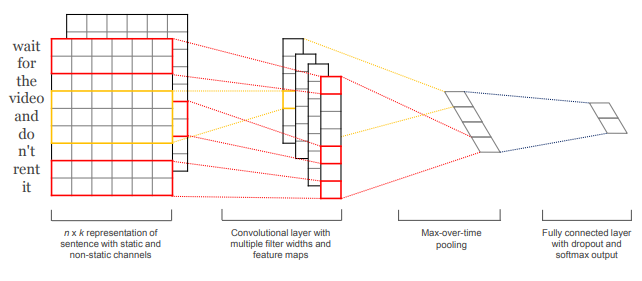

This is the fourth entry in a sequence of posts about working with natural language, and specifically the script of The Office. In [the previous post](https://conleyst.github.io/2018-05-23-random-forest-log-reg/), I built a baseline random forest model using a bag-of-words model for the text, and then beat its accuracy score with a logistic regression model using TFIDF.

All the relevant project code can be found in [the GitHub repository](https://github.com/conleyst/bears-beets-nlp) and all the current blog posts in the series are:

- [Part 1: Scraping The Office Script with Scrapy and BeautifulSoup](https://conleyst.github.io/2018-05-21-scraping-data/)

- [Part 2: Cleaning the Data and Exploratory Data Analysis](https://conleyst.github.io/2018-05-22-clean-eda/)

- [Part 3: Bag-Of-Words, Random Forest, TFIDF, and Logistic Regression](https://conleyst.github.io/2018-05-23-random-forest-log-reg/)

- [Part 4: Glove Embeddings and a Convolutional Neural Net for Text Classification](https://conleyst.github.io/2018-05-26-convnet/)

---

If you read through the previous blog post in this series, you saw that we built two models for predicting which character said a line from The Office. We saw that theh baseline, random forest model was barely better than random chance and the logistic regression model offered a modest improvement. In this post, I'll describe a more advanced model that can beat both of these models -- a convolutional neural network for text classification, as outlined in [the paper here](https://arxiv.org/abs/1408.5882).

#### The Theory

Deep learning is a *huge* field, and there's no way that I can give a full description of how the model works, but I'll try and give the highlights.

**Glove Embeddings**

We saw two ways to represent a sentence as a vector in the previous post (i.e. using a bag-of-words and using tf-idf). There are still other ways to do this, and Glove embeddings are one way. The [original paper](https://nlp.stanford.edu/pubs/glove.pdf) gives a full account of how the mbeddings are found, but the fundamental idea is that we should get embeddings based on the co-occurrence matrix of word (e.g. how often does word w appear near word v?). Some words tend to appear near the same words. For example, 'water' tends to appear near both 'steam' and 'ice', as does 'state' and 'phase'. On the other hand, 'cold' tends to appear near 'ice', but not 'steam'. Words are similar if they have similar co-occurrences with other words, and so we might say that in some abstract sense, 'ice' is similar to 'steam'.

These embeddings (100-dimensional for the ones I used in my project), have a very, very cool analogy property. The classic example goes as follows. Take the vector for king, subtract man, and add woman. Then the nearest word vector to this new vector is queen! It's actually the case that *king - man + woman = queen*. The notion of similarity used here is *cosine similarity*. This means two things are close together if they point in similar directions.

**The Convolutional Neural Net**

If you take a look at the paper I linked to above, you'll see the following image describing the convnet,

<p align="center">
  
</p>

It works as follows:

1. For a given sentence ("Wait for the video and don't rent it" in the example above), tokenize it, change the words to lower case, and retrieve the embeddings for the tokens (in the paper they use word2vec embeddings, but I used Glove -- both are fine!). Stack the embeddings in a matrix. This means that if you have a sentence with 10 tokens and you use embeddings with 100-dimensions, the matrix representing the sentence will be 10x100.

2. Our filters are the full width of the matrix -- 100 in our running example -- and of whichever height we want. We use valid padding, meaning that the stride of our filter will only be vertical. This might seem odd, but you should be thinking about n-grams right now. A filter with height 3 is like taking all trigrams of the sentence we want to classify. for a filter of height 3, this outputs a vector of length *100 - 3 + 1 = 98* in our running example. We do this for many filters (300 total in the paper -- 100 of size 3, 4, and 5). A relu activation is then applied at this step.

3. We then apply max-pooling to the outcome of the filters. So we would just take the maximum of the length 98 vector that we were considering earlier.
We then concatenate everything -- so if we use 300 filters, the concatenated vector we get will have length 300.

4. Finally, we use  a fully-connected layer with a softmax output. For training, we'd apply dropout at this step (see my code for an example). If we have 5 classes we want to predict into, this final layer would be a vector of length 5 giving the class probabilities.

#### The Practice

I used `tensorflow` to implement the neural net, which has nice built in operations to handle the embedding look-up. Suitable embeddings for the classification were learned during training, but to give the model a head-start and to try and improve accuracy, I initialized the embeddings using 100-dimensional Glove embeddings.

```
# define inputs
lines = tf.placeholder(tf.int32, name='lines')
lines_labels = tf.placeholder(tf.float32, name='lines_labels')
keep_prob = tf.placeholder(tf.float32, name='keep_prob')  # to control drop out for training/prediction

# define embeddings layer
embeddings = tf.Variable(initial_value=embedding_matrix, trainable=True, name='embeddings')
lines_embedding = tf.nn.embedding_lookup(embeddings, lines)
lines_embedding = tf.expand_dims(lines_embedding, -1)  # we need to add a channel dim (dim=1)
lines_embedding = tf.cast(lines_embedding, dtype=tf.float32)
```

For filters, I used 100 filters of size 3, 4, and 5, so 300 total, just like the paper. Using the function,

```
# create tf graph
def conv_maxpool_layer(filter_size, n_filters, conv_input):
    """Produce max pooling layer for fixed filter size with specified number of filters."""

    filter_weights = tf.Variable(initial_value=tf.truncated_normal(shape=[filter_size, 100, 1, n_filters]),
                                 name='filter_weights',
                                 dtype=tf.float32)
    bias = tf.Variable(initial_value=tf.zeros(shape=[n_filters]),
                       name='bias')
    conv = tf.nn.conv2d(input=conv_input,
                        filter=filter_weights,
                        strides=[1, 1, 1, 1],
                        padding='VALID',
                        name='conv')
    conv_relu = tf.nn.relu(features=conv + bias,
                           name='relu')
    max_pool = tf.nn.max_pool(value=conv_relu,
                              ksize=[1, 49 - filter_size, 1, 1],  # recall conv output is of size height-filter_size+1
                              strides=[1, 1, 1, 1],  # applying max pooling line-wise
                              padding='VALID',
                              name='max_pool')

    return max_pool
```

I added the convolutional layers to the graph I built,

```
# define convolutional layers using helper function
conv_outputs = []
for i in filter_sizes:
    with tf.name_scope(
            'conv_filter_size_{}'.format(i)):  # have to make layers within scope of different convolutions
        conv_outputs.append(conv_maxpool_layer(filter_size=i, n_filters=n_filters, conv_input=lines_embedding))
```

I then concatenated the output from all the max-pooling,

```
# concatenate the convolution outputs into a single vector of length 3*n_filters
concat_output = tf.concat(values=conv_outputs, axis=3)
concat_output = tf.reshape(tensor=concat_output, shape=[-1, 3 * n_filters])
```

added dropout, and created a fully-connected layer,

```
# make fully connected layer w/ dropout
dropout = tf.nn.dropout(concat_output, keep_prob=keep_prob)
fc_weights = tf.Variable(tf.truncated_normal(shape=[3 * n_filters, n_chars]),
                         name='fc_weights')
fc_bias = tf.Variable(tf.zeros(shape=[n_chars]), name='fc_bias')
logits = tf.matmul(dropout, fc_weights) + fc_bias
```

Finally, I defined the metric I wanted to use, the loss, and used `Adam` for optimization,

```
# prediction and loss
softmax_output = tf.nn.softmax(logits)
predictions = tf.argmax(softmax_output, axis=1)
accuracy = tf.metrics.accuracy(tf.argmax(lines_labels, axis=1), predictions, name='accuracy')
loss = tf.reduce_mean(tf.nn.softmax_cross_entropy_with_logits_v2(logits=logits, labels=lines_labels))
optimizer = tf.train.AdamOptimizer(learning_rate=0.001).minimize(loss)
```

For training, I used a batch size 0f 63 and ran 50 epochs for training.

```
sess.run(tf.global_variables_initializer())  # initialize global variables
sess.run(tf.local_variables_initializer())  # necessary for accuracy
saver = tf.train.Saver()  # create object to save model after training

for epoch in range(n_epochs):
    i_shuffle = np.random.permutation(X_train.shape[0])
    X_train = X_train[i_shuffle]
    y_train = y_train[i_shuffle]
    for batch in range(X_train.shape[0] // batch_size):
        X_batch = X_train[batch * batch_size:(batch + 1) * batch_size]
        y_batch = y_train[batch * batch_size:(batch + 1) * batch_size]

        feed_dict = {lines: X_batch, lines_labels: y_batch, keep_prob: 0.5}
        _, batch_loss = sess.run([optimizer, loss], feed_dict=feed_dict)

    _, train_accuracy = sess.run(accuracy, feed_dict={lines: X_train, lines_labels: y_train, keep_prob: 1})
    print("Training accuracy after epoch {}: {}".format(epoch, train_accuracy))

    if epoch % 10 == 0:  # get test accuracy every 10 epochs
        _, test_accuracy = sess.run(accuracy, feed_dict={lines: X_train, lines_labels: y_train, keep_prob: 1})
        print("Test accuracy after epoch {}: {}".format(epoch, test_accuracy))

# view training accuracy of trained model
_, test_accuracy = sess.run(accuracy, feed_dict={lines: X_train, lines_labels: y_train, keep_prob: 1})
print("Final test accuracy of trained model is {}".format(test_accuracy))
saver.save(sess, save_path="../results/convnet/convnet-50")

# save softmax output for training and test set
train_softmax_array = sess.run(softmax_output, feed_dict={lines:X_train, keep_prob: 1})
test_softmax_array = sess.run(softmax_output, feed_dict={lines: X_train, keep_prob: 1})
np.save("../results/convnet/train_softmax", train_softmax_array)
np.save("../results/convnet/test_softmax", test_softmax_array)
```

#### The Results

This model was able to beat both the baseline random forest model and the logistic regression model (which had test accuracies of roughly 28.7% and 36.2%, respectively). The trained model had a test accuracy of roughly 41.4% (0.4144217073917389), comfortably beating the logistic regression model. The training accuracy was also roughly 41.4% (0.41372424364089966), so it doesn't seem that the model is overfitting.

Although the convnet model accuracy is lower than I naively might have hoped, upon further reflection, it isn't that surprising for a couple reasons.For one, deep learning can be incredibly effective at finding patterns when you have lots of data, but the patterns do need to be there. The Office is a great show, with a lot of unique characters, and so we might think that it would be relatively easy to classify lines. But so much of that difference is in delivery and mannerism. A lot of what is said by the characters isn't so different. Take the line, "Customer service might be monitoring this conversation.". It's long enough and distinct enough that we might think we could identify the speaker. Having seen the series though, I could imagine any of Michael, Dwight, Jim, or Pam easily saying it (for the record, it was Dwight). The text itself might not offer as many clues as I'd hoped to who said it.

The second reason is similar to the first one. Some lines are so short as to be irrelevant. Lines like "Who's that?" or "Easy." contain no info at all. Our model is likely guessing at random in this case.

---

Unless I'm struck by inspiration, this will likely be the last post in the series. Get in touch if you have any questions, or if you have any ideas on how to improve the models!
